# Anticode

**The Enterprise-Grade Distributed Nothing Platform™**


Anticode is a cloud-native, blockchain-audited, AI-powered, quantum-verified,
type-safe, ISO-NOTHING-9001-compliant platform for the industrial production of
**nothing**. Sixteen programming languages, thirty-three microservices, one
machine, zero output. Every zero is artisanal, individually verified by a
freshly started Java Virtual Machine, toured through all time zones, vibed by
Julia, mined into a proof-of-waste blockchain, and faxed to a machine that
does not exist.

This paragraph​​​​​​​​​​​​​​​​ contains our entire security roadmap, encoded in zero-width
Unicode characters. Run `python3 tools/decode_secret.py README.md` to reveal it.

## Quick Start

```bash
make nothing    # produce, verify, certify, and fax nothing (~5-8 minutes)
make test       # assert that 0 == 0 in fifty independent ways
make clean      # return the repository to its natural state
make synergy    # leverage cross-functional alignment (safe to run in prod)
```

## Architecture

```mermaid
flowchart TD
    A[Bash: Compliance Bootstrap] --> B[Java: 100,000 Named Constants]
    B --> C[Python: Bit-Shift Arithmetic<br/>no literals, no self-affirmation]
    C -->|equality verdicts,<br/>one JVM each| B
    C --> D[TypeScript: 100,000 Records of Zero]
    D --> E[C: fib&#40;n&#41; − fib&#40;n&#41; Engine]
    E --> F[C++: Quadratic String of Zeroes]
    F --> G[Go: 100 Goroutines, One Ring, Zero Cargo]
    G --> H[Rust: Type-State Nothing + Quantum Lab]
    H --> I[Java: Verification Bean]
    I --> J[Perl: JSON via Regex]
    J --> K[awk: Statistics of 100,000 Zeros]
    K --> L[Perl: ping 0.0.0.0]
    L --> M[Ruby: API That Calls Itself ×100]
    M --> N[Ruby: 0 Tours All Time Zones]
    N --> O[PHP: DreamBerd Deletes Itself]
    O --> P[Julia: Zeroeyness Vibe Census]
    P --> Q[Python: NeuralNothing™ AI]
    Q --> R[Go: Zerochain™ Proof of Waste]
    R --> S[sed: s/0/0/g ×2]
    S --> T[Python: Zoo of Zeroes / −0.0 Crisis]
    T --> U[JS: Falsy Symposium]
    U --> V[Python: 200×200 Zero Matrix, Naive]
    V --> W[dd: /dev/zero → /dev/null, 2 GB]
    W --> X{0^0^0 Schism<br/>Perl says 0, PHP says 1}
    X -->|binding arbitration| I
    X --> Y[Python: Final Audit & Certificate]
    Y --> Z[Roman Numeral Exit-Code Relay]
    Z --> FAX[Bash: Fax at 300 baud]
```



Inter-service communication uses **envelopes**: JSON documents in `void/`
carrying a UUID, timestamps, a checksum computed twice and compared with
itself, and payloads encrypted with **ROT26** (ROT13 applied twice — defense
in depth; see [SECURITY.md](SECURITY.md)).

## Departments

| Directory | Department | Language | Contribution |
|---|---|---|---|
| `bootstrap/` | Environment Compliance Division | Bash | 0 |
| `enterprise/` | Number Constants Oracle & Equality Court | Java | 0 |
| `services/arithmetic/` | Arithmetic Microservice | Python | 0 |
| `services/transport/` | Data Transport & Logistics | TypeScript | 0 |
| `engine/` | High-Performance Nothing Engine | C | 0 |
| `services/accumulator/` | Zero Accumulation Buffer & Monastery | C++ | 0 |
| `services/concurrency/` | Concurrency Waste Management | Go | 0 |
| `services/typesafety/` | Type-Safety Theater & Quantum Lab | Rust | 0 |
| `legacy/` | Legacy Compatibility Gateway | Perl | 0 |
| `analytics/` | Analytics & Insights | awk | 0 |
| `network/` | Void Uplink Reliability Monitor | Perl | 0 |
| `api/` | Recursive Self-Service API (Ouroboros) | Ruby | 0 |
| `bureau/` | Time Zone Bureau & Substitution Bureau | Ruby, sed | 0 |
| `deathbed/` | DreamBerd Self-Deletion Facility | PHP, DreamBerd | 0 |
| `vibes/` | Zeroeyness Vibe Analytics | Julia | 0 |
| `ai/` | NeuralNothing™ AI Division | Python | 0 |
| `blockchain/` | The Zerochain™ | Go | 0 |
| `ontology/` | Zoo of Zeroes & IEEE −0.0 Crisis Unit | Python | 0 |
| `symposium/` | The Falsy Symposium | JavaScript | 0 |
| `linalg/` | Naive Matrix Department | Python | 0 |
| `supply/` | Zero Supply Chain & Containerization | dd, tar | 0 |
| `theology/` | The Exponentiation Schism (0^0^0) | Perl v. PHP | 0 *and* 1 |
| `telecom/` | Fax Gateway | Bash | pending since 1994 |
| `audit/` | Final Audit, Certification & Roman Relay | Python | 0 |
| `k8s/` | Cluster That Does Not Exist | YAML | 0 replicas |

## Corporate Policies

1. **No numeric literals in the Python area.** All numbers are fetched by
   English name from the Java Number Constants Oracle.
   ([ADR-002](docs/adr/ADR-002-no-plus-operator.md))
2. **No self-affirming code.** No process may assert that two numbers are
   equal. Equality verdicts are issued exclusively by
   `enterprise.EqualityOracle`, one fresh JVM per verdict.
   ([ADR-004](docs/adr/ADR-004-equality-as-a-service.md))
3. **All output must be nothing.** Output that is something is a Sev-0
   incident.

## Enterprise Support

Support is available 24/0. Our SLA guarantees a response time of 0, which we
have never once failed to deliver in 0 years of operation. For escalations,
please attend the standing meeting (`void/meeting_that_could_have_been_an_email.ics`).

## FAQ

**Q: What does it do?**
A: Nothing, but exhaustively.

**Q: How long does it take?**
A: 5–8 minutes, which is 2 weeks in Estimation Office units.

**Q: Is 0^0^0 equal to 0 or 1?**
A: The matter is in binding arbitration. The pipeline proceeds pending appeal.

**Q: Why?**
A: See ADR-001.

## License

MIT. You are free to use this software for anything, which is more than it
will ever do for you.
